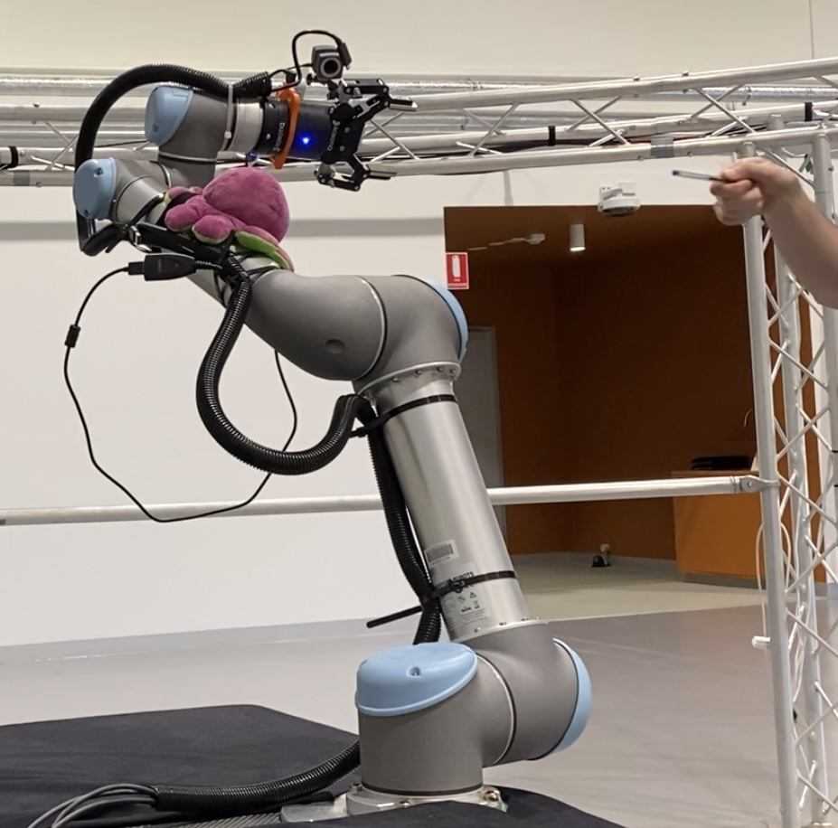

# 🦾 Deep Human-Robot Handover
<!--  -->
<p align="center">
    
</p>

## Project structure
```.
├── assets                          images for the README
├── data                            data to train on
│   └── 2021-12-09-04:56:05
├── docker                          files for creating and running docker containers
├── include
│   └── e2e_handover                header files for cpp ROS nodes
├── launch                          ROS launch files
├── models                          trained models
├── param                           ROS parameters for setting sensor suite
├── scripts                         python ROS nodes
├── src
│   └── e2e_handover                python modules for re-use, and cpp ROS nodes
│       ├── evaluate                scripts for evaluating models (viewing inference, computing stats)
│       ├── prepare                 scripts for data prep (calibration, combination, labelling)
│       └── train                   scripts for training models and defining model architecture
└── urdf                            robot description files (unused)
```

## Force Thresholding Baseline Approach
Robot activates or releases the gripper when it detects a sufficient force in the z-axis.

`roslaunch e2e_handover force_baseline.launch`

## Data recording

Data is stored in the `data` directory.

Pressing 'r' begins or ends a recording session, identified by a timestamp. Images and a csv file for each session are stored in a folder. Pressing 'shift' toggles the gripper state manually.

`roslaunch e2e_handover recording.launch`

Optionally, record the raw ROS messages with `rosbag record rosout /camera/color/image_raw robotiq_ft_wrench Robotiq2FGripperRobotInput /Robotiq2FGripperRobotOutput`

## Data preparation
1. Calibrate the forces by zeroing out using the first reading: `python3 src/e2e_handover/prepare/calibrate_forces.py --data raw.csv`
2. Combine data sets together: `python3 src/e2e_handover/prepare/combine_sets.py --data data/2022-02-09-0*rhys/*_calib.csv --out data/2022-02-09-05_rhys/2022-02-09-05_calib_rhys.csv`
3. Manually edit the open/closed labels: `python3 src/e2e_handover/prepare/grip_labeller.py --data data/2022-02-09-05_rhys/2022-02-09-05_calib_rhys.csv`
4. Specify which frames belong to "giving" set or "receiving" set: `python3 src/e2e_handover/prepare/annotate_direction.py --data data/2022-02-09-05_rhys/2022-02-09-05_rhys_calib_labelled.csv.csv`
5. (Optional) offset the data so that the model tries to predict the state in N frames: `python3 src/e2e_handover/prepare/use_future.py --data data/2022-02-08-03\:41\:24_owen/2022-02-08-03\:41\:24_calib_labelled_receive.csv --offset 5`

## Training

- Define the sensor suite to be used when training in `src/e2e_handover/train/params.yaml`
- `python3 src/e2e_handover/train/train.py --data data/2022-01-25/2022-01-25-05\:27\:11/2022-01-25-05\:27\:11.csv`
- Go to [wandb.ai](https://wandb.ai) to see the results of training. 

## Inference

- Define the sensor suite to be used for inference in `param/handover_params.yaml`
- Launch sensors and inference node: `roslaunch e2e_handover inference.launch`

Pressing 'i' starts or stops inference.

# Hardware Setup
- UR5 Robot
- 2x Intel Realsense 2 RGBD cameras
- Robotiq 2F85 gripper
- Robotiq FT300 force-torque sensor
- 2x Contactile papillarray tactile sensors

# Dependencies
## Method 1: Using Docker (recommended)

- Install docker (using `sudo apt install docker.io`)
- Install [nvidia-docker2](https://docs.nvidia.com/datacenter/cloud-native/container-toolkit/install-guide.html#setting-up-nvidia-container-toolkit) for cuda (GPU) support
- Run `./docker/run.sh`

## Method 2: Building from source
- [ROS Noetic](http://wiki.ros.org/noetic/Installation)
- [Universal Robots ROS Driver](https://github.com/UniversalRobots/Universal_Robots_ROS_Driver) (Follow *Building* instructions)
- [fmauch Robot Descriptions](https://github.com/fmauch/universal_robot) (Should be installed as per Universal Robots instructions)
- [Robotiq drivers (updated to work with ROS Noetic)](https://github.com/jr-robotics/robotiq.git) (Clone into `src` directory)
- [Realsense Camera ROS Drivers](https://github.com/IntelRealSense/realsense-ros)

Aside from ROS itself, these dependencies can be downloaded automatically by `vcstool` (install with `sudo apt install python3-vcstool`), then go to `catkin_ws/src` directory and run `vcs import < e2e-handover/e2e.rosinstall`.

To update the dependency list when adding more packages in the future, use `vcs export > e2e.rosinstall`.

Ensure pip is installed via `sudo apt-get install python3-pip`.

Install additional dependencies by running `rosdep install --from-paths src --ignore-src -r -y` from your catkin workspace.

Build by running `catkin_make -DCMAKE_BUILD_TYPE=Release` from your catkin workspace.

<!-- # Managing data and models

- Install [dvc](https://dvc.org/doc/install/linux) -->

# Miscellaneous commands for reference
Bring up communication with the robot:
`roslaunch ur_robot_driver ur5_bringup.launch robot_ip:=10.0.0.2`

Move the robot into position:
- `roslaunch e2e_handover position.launch`
- `rviz -d launch/e2e_handover.rviz`
- Click 'next' in RvizVisualTools

Viewing the robot urdf:
`roslaunch e2e_handover view_ur5_ft_grip_table.launch`

Gripper communication:
`rosrun robotiq_2f_gripper_control Robotiq2FGripperRtuNode.py /dev/ttyUSB0`

Force/torque sensor comms:
`rosrun robotiq_ft_sensor rq_sensor`

Camera:
`roslaunch realsense2_camera rs_camera.launch`
or `roslaunch camera_driver realsense_driver.launch`

Testing recorder:
- Place an image in data/test.png
- `roslaunch e2e_handover test_recording.launch`

Testing inference:
- `roslaunch e2e_handover test_inference.launch`

Running in gazebo
- `roslaunch ur_gazebo ur5_bringup.launch` / `roslaunch e2e_handover ur5_bringup_gazebo.launch`
- `roslaunch ur5_moveit_config ur5_moveit_planning_execution.launch sim:=true`

Combine datasets:
`python3 src/e2e_handover/prepare/data_prep.py --session 2021-12-17-tactile combine -l 2021-12-17-00:55:09 2021-12-17-01:01:44`

Running position node outside gazebo
- `roslaunch ur5_moveit_config ur5_moveit_planning_execution.launch`
- `rosrun e2e_handover position`

Running position node in gazebo

- `roslaunch e2e_handover position.launch`

## Pairing controller
- For DualShock PS4 controller, press and hold both the Share and PS buttons.
- Open Bluetooth settings and click on 'Wireless controller' to pair.
